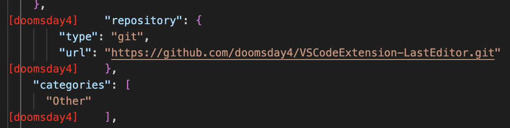
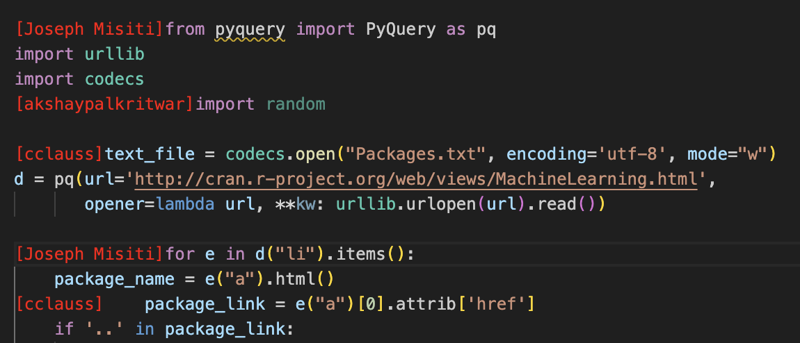

# lasteditor README

This is the README for our extension "lasteditor".
This will keep a record of all the functioning and usage of the extension.

## Features

1. The main feature of this extension is to display the name of the last editor of each line of a code.
2. It uses the Git Blame command to read and extract content from the git database.
3. With the latest version, the name of the last editor of the selected line of code is displayed on the leftmost corner of the line, in red colour.

<u>For example:</u> I've attached 2 screenshots, diplaying the names of the authors of the code.

Personal Repo:

Public Repo:

## Requirements

The major requirements are:
1. Have the npm package manager to build the extension and deploy it.

<!-- ## Extension Settings

Include if your extension adds any VS Code settings through the `contributes.configuration` extension point.

For example:

This extension contributes the following settings:

* `myExtension.enable`: Enable/disable this extension.
* `myExtension.thing`: Set to `blah` to do something. -->

<!-- ## Release Notes

Users appreciate release notes as you update your extension.

### 1.0.0

Initial release of ...

### 1.0.1

Fixed issue #.

### 1.1.0

Added features X, Y, and Z.

--- -->

## Following extension guidelines

Ensure that you've read through the extensions guidelines and follow the best practices for creating your extension.

* [Extension Guidelines](https://code.visualstudio.com/api/references/extension-guidelines)

**Enjoy!**
